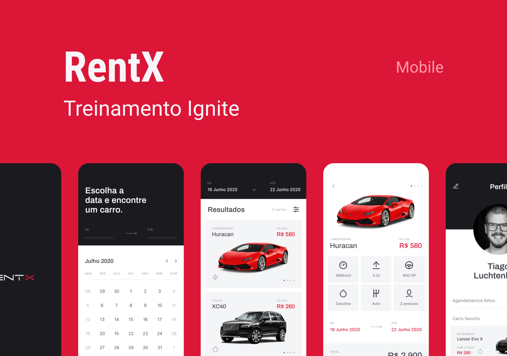

## 💻 Projeto

O projeto 'RentX Mobile' é uma aplicação mobile de locadora de veículos.

  

## 🚀 Tecnologias

Esse projeto foi desenvolvido com as seguintes tecnologias:

* React Native
* Expo Bare Workflow
* TypeScript
* Styled Components
* Async Storage
* React Navigation
* Yup
* Axios
* Date-fns
* Lottie
* Reanimated
* React Native Calendars